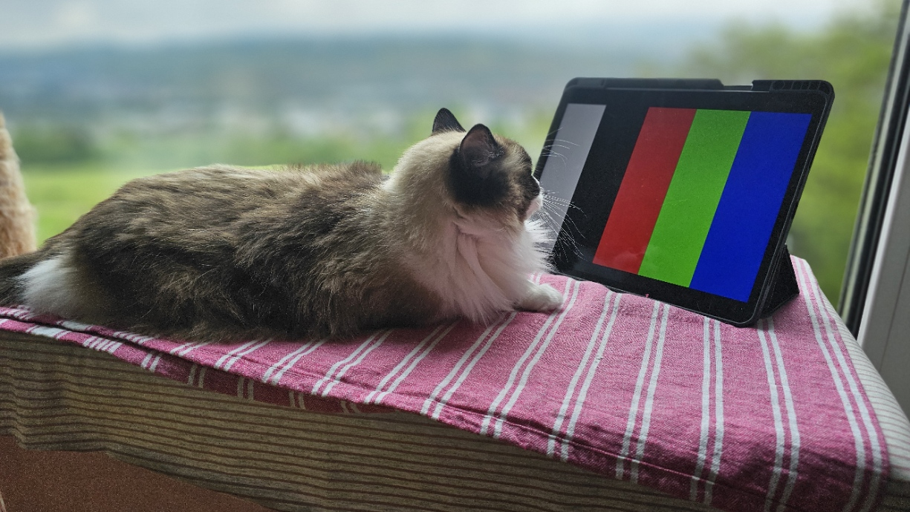

# Brightness, Contrast, Color Coverage, Haze, Viewing Angle, dan Refleksi: Parameter yang Sering Disalah-pahami

"Moko lagi ngecek color gamut. Katanya warna merah di panel IPS dengan mini LED lebih enak dilihat dan kontrasnya bagus 😼"

Kamu pernah beli monitor mahal, tapi pas nyalain di ruang kerja, kok "kurang tajam"? Atau mungkin kamu pernah ketipu spek "100% sRGB" yang ternyata warna-nya di layar cuma biasa aja?

Saya sering ketemu ini di meeting. Client minta "bright screen" dan "great colors", tapi pas saya tanya detail, ternyata mereka belum paham betul parameter yang sebenarnya bikin display jadi enak dilihat.

Jadi mari kita bedah 6 parameter display yang sering bikin orang salah pilih, dari kacamata lead engineer yang pernah nyemplung di Sony, Intel, dan Motherson.

## 1. Brightness (Nits): Bukan Semakin Besar, Semakin Bagus

Brightness itu ukuran cahaya yang keluar dari layar, biasanya dalam unit "nits" atau candela per meter persegi (cd/m²).

Banyak orang mengira monitor 1000 nits pasti lebih bagus dari 300 nits. Padahal di dunia nyata, brightness itu harus pas dengan lingkungannya.

Contoh, kamu pakai tablet di dalam mobil siang hari di Stuttgart. Kamu butuh 800 nits supaya layarnya tetap terbaca. Tapi kalau kamu pakai laptop buat kerja malam hari di kamar, 300 nits aja udah cukup. Malah kalau 1000 nits, matamu bakal sakit.

Di Motherson, saya pernah ngerjain project display untuk exterior yang harus survive di bawah cahaya matahari langsung. Kalau makai LCD, kita harus memikirkan gimana *heat dissipation* backlightnya dan juga degradasinya di jangka panjang.

**Jadi intinya:** Brightness itu soal *konteks*, bukan sekadar angka marketing.

## 2. Contrast Ratio: Kenapa Hitam Bisa Terasa "Abu-abu"

Contrast ratio itu perbandingan antara cahaya terang (putih) dan cahaya gelap (hitam) yang bisa dihasilkan panel.

LCD itu punya masalah klasik. Dia butuh lampu di belakangnya, jadi hitam yang ditampilkan itu sebenarnya "hitam yang redup", bukan hitam beneran. Kalau kamu pernah nyalain TV LED di ruangan gelap dan lihat bagian hitam-nya abu-abu, itu masalah contrast ratio.

OLED beda cerita. Karena pixel-nya nyalain sendiri, OLED bisa matikan pixel hitam sepenuhnya. Hasilnya? Hitam yang bener-bener pekat, dan warna yang berasa "melayang" di atas layar.

Di Sony VAIO, kita pernah pusing banget bikin laptop tipis dengan kontras tinggi. Kita akhirnya harus pakai panel VA (Vertical Alignment) yang contrast rasio-nya jauh lebih bagus dari TN (Twisted Nematic) yang biasa dipakai di laptop murah saat itu.

**Perumpamaan:** Contrast itu kayak suara speaker. Brightness itu volume, tapi contrast itu kualitas bass dan treble-nya. Volume besar tapi bass tipis, suaranya jadi "datar".

## 3. Color Coverage: 100% sRGB Bukan Selalu "Terbaik"

Warna yang bisa ditampilkan layar diukur dengan "color gamut". Yang paling umum adalah sRGB, Adobe RGB, DCI-P3 dan *ultimate color* Rec-2020.

Banyak orang langsung tanya "udah 100% sRGB belum?". Padahal sRGB itu standar lama yang cukup terbatas. Kalau kamu kerja di industri film atau desain grafis, kamu butuh DCI-P3 atau bahkan Adobe RGB supaya warna-nya lebih hidup dan akurat.

Tapi ada jebakan. Layar yang gamut-nya besar, tapi *color accuracy*-nya jelek, malah bikin warna terlihat "mual". Saya sering lihat monitor gaming murah yang klaim 100% sRGB, tapi pas diukur warnanya melenceng jauh.

Rec-2020 ? ini punya kriteria sendiri, kalau punya dompet tebal, boleh lah kita mulai bicara tentang *color coverage* ini.

**Tips engineer:** Jangan cuma lihat "coverage", tapi pastikan monitor itu punya "factory calibration" atau minimal delta-E di bawah 2. Itu ukuran akurasi warna beneran.

## 4. Haze: Parameter Tersembunyi yang Bikin Display "Kusam"

Haze ini jarang orang dengar, tapi dia punya dampak besar. Haze itu ukuran "kabut" atau cahaya yang menyebar di permukaan display.

Kalau haze-nya tinggi, display kamu bakal berasa kayak dilihat dari balik kaca tipis yang agak buram. Gambar-nya kurang "pop", warna-nya kurang tajam. Ini sering terjadi kalau kamu pakai tempered glass pelindung layar yang murah.

Di *consumer electronics*, kami harus hati-hati banget pilih material kaca depan display. Kalau haze-nya tinggi, di siang hari display jadi sulit dibaca dan matanya cepat lelah.

**Perumpamaan:** Haze tinggi itu kayak jendela kamar mandi yang lagi berkabut tipis. Kamu masih bisa lihat ke luar, tapi semuanya berasa kurang jernih.

## 5. Viewing Angle: Kenapa Warna Gak Sama Kalau Dipandangi dari Samping?

Viewing angle itu seberapa besar sudut kamu bisa pandang layar sebelum warnanya berubah atau kontrasnya turun.

Tiga jenis panel LCD punya masalah beda:

- TN (Twisted Nematic): Paling murah, tapi kalau dipandang dari samping, warnanya langsung "balik" atau pucat.
- VA (Vertical Alignment): Contrast bagus, tapi viewing angle masih agak terbatas.
- IPS (In-Plane Switching): King of viewing angle. Warna konsisten dari mana aja kamu pandang.

Di Sony, kami sering pakai panel IPS untuk tablet premium karena tablet itu sering diputar (landscape/portrait) atau ditengahkan buat ditonton berdua. Kalau pakai TN, orang yang duduk di samping bakal lihat warna yang beda.

**Perumpamaan:** Viewing angle itu kayak ngobrol di ruang tamu. Orang yang duduk di depan TV dengar suara jelas. Orang yang duduk di samping, kalau speaker-nya jelek, suaranya jadi kedengar "tutup" atau pelan.

## 6. Refleksi: Musuh Utama Display di Luar Ruangan

Refleksi atau glare itu cahaya dari luar yang memantul di layar. Ini musuh utama display HMI di mobil.

Bayangkan kamu pakai GPS di dashboard mobil pas matahari sore. Kalau refleksi-nya tinggi, layar jadi kayak cermin. Kamu gak bisa lihat peta, dan ini bisa fatal.

Cara engineer lawan ini ada dua:

1. **Anti-reflective coating:** Lapisan tipis di permukaan kaca yang nyerap cahaya, bukan memantulkannya.
2. **Transflective display:** Teknologi yang bisa pakai cahaya ambient (matahari) buat bantu nyalain layar, jadi dia malah jadi lebih terbaca kalau terang-terangan. Nanti kita bahas tentang reflective dan transflective technology di lain kali ya.

**Perumpamaan:** Refleksi tinggi itu kayak cermin di dalam mobil. Kamu bisa lihat pantulan wajah sendiri, tapi kamu gak bisa lihat jalan di depan.

## Ringkasan: Apa yang Penting Buat Kamu?

Kalau kamu beli display buat kerja atau main, ini panduan simpel-nya:

| Parameter          | Penting untuk...                                     |
| ------------------ | ---------------------------------------------------- |
| **Brightness**     | Display yang dipakai di luar ruangan / cahaya terang |
| **Contrast**       | Nonton film, gaming, desain visual                   |
| **Color Coverage** | Desainer, fotografer, kreator konten                 |
| **Haze**           | Ketajaman warna, kenyamanan baca teks                |
| **Viewing Angle**  | Pakai layar bareng orang lain, tablet, laptop        |
| **Refleksi**       | HMI mobil, outdoor display, tablet di bawah matahari |

Makanya, display yang "bagus" itu tergantung *siapa kamu* dan *di mana kamu pakai*. Nggak ada display yang jago di semua kategori.

---

**📸 Foto yang bisa diambil:**

1. **Moko the Detail Inspector**
   
   - *Setup:* Moko lagi duduk di meja kerja, iPad di depannya menampilkan 3 warna berbeda (merah, hijau, biru)
   - *Sudut:* Dari samping iPad, fokus ke mata Moko yang liat warna
   - *Vibe:* "Kucing yang lagi nge-check color accuracy"
   - *Caption suggestion:* "Moko lagi ngecek color gamut. Katanya warna merah di panel IPS lebih enak dilihat 😼"

2. **Moko the Refleksi Problem**
   
   - *Setup:* Moko lagi duduk di depan jendela, iPad di tangannya (atau di pangkuannya) yang kena cahaya matahari langsung
   - *Sudut:* Dari belakang Moko, fokus ke pantulan cahaya di layar iPad
   - *Vibe:* "Kucing yang bingung liat layar karena matahari sore"
   - *Caption suggestion:* "Moko: 'Matamu masih bisa baca? Aku udah keder sama glare-nya ini'"

---
