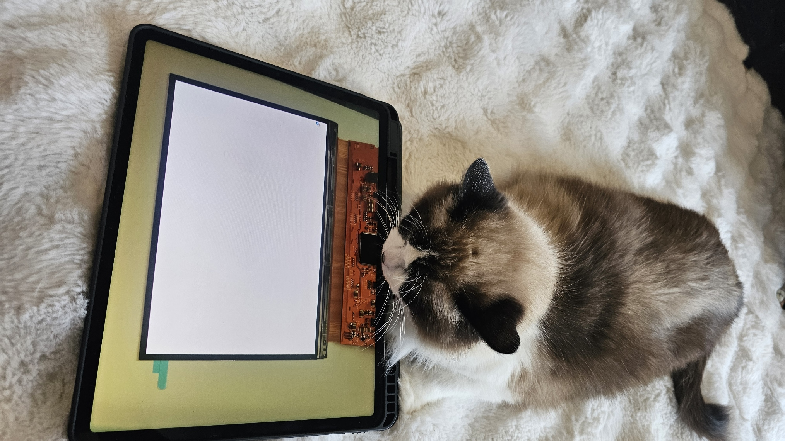

# Blog Draft: "LCD, OLED, atau microLED untuk HMI : Trade-off Nyata, Bukan Slide PPT"

**Topic:** LCD vs OLED vs microLED trade-offs for automotive HMI applications
**STATUS:** DRAFT — ready for review
**Channel:** Blog ID (Medium/Substack)

---

"Bingung nih... ini LCD apa OLED ya ? 😼"

Tahun 2010, saya kerja di desain produk Sony VAIO. Display controller yang kita bikin harus bisa handle panel LCD dengan resolusi yang belum ada di pasar. Waktu itu, OLED masih di lab — belum siap untuk produk konsumen, apalagi automotive.

Sekarang, 16 tahun kemudian, saya di Stuttgart kerja sama tim tentang integrasi display in interior dan exterior mobil. Dan pertanyaannya bukan lagi "LCD atau OLED?" tapi "LCD, OLED, atau microLED?" ... karena ketiganya ada di meja meeting OEM.

Masalahnya: di internet dan di powerpoint, semuanya terlihat sempurna. Di lapangan? Beda cerita, dan itu yang saya mau bahas.

## Brightness : OLED masih kalah di satu hal

OLED cenderung punya warna yang lebih hidup karena material yang dipakai biasanya punya karakteristik spektrum yang lebih tajam (tentang color spectrum, dibahas di lain kali aja ya..), setiap sub-pixel nyala sendiri, bukan diterangi backlight. Bagus buat kontrast, tapi, sering kurang terang dibanding LCD.

Di mobil, kadang display harus bisa dilihat di bawah sinar matahari langsung. Bukan "terang di dalam showroom" tapi terang di dashboard yang menghadap selatan jam 2 siang di Stuttgart, yang mataharinya kadang masuk ke ruang mobil.

LCD dengan LED backlight bisa tembus 1000+ nits (cd/m2) untuk automotive grade. OLED? Masih di 600-800 nits untuk panel besar, biarpun ada beberapa yang mengklaim nembus 1000 nits. Dan itu belum termasuk *solar loading*, yaitu kalau panel OLED kena sinar matahari terus, dia harus *dim down* sendiri biar tidak kepanasan.

Kalau brightness adalah prioritas, dan di HMI, visibility itu safety, LCD masih punya advantage.

## Burn-in : masalah yang belum selesai

OLED punya pixel organik yang *decay* dengan laju berbeda tergantung berapa lama dia nyala. Static content, seperti dashboard gauge, navigation bar, atau menu icon yang selalu di posisi sama, bisa bikin *image retention* dalam 6 bulan. 

Di consumer TV, ini bukan masalah karena content-nya terus berubah. Di automotive HMI? Konten static-nya banyak. Dashboard layout tidak berubah. Navigation bar dan menu lainnya selalu di bawah.

Solusinya? Pixel shifting (menggeser static content beberapa pixel dalam beberapa rentangan waktu), logo dimming, dynamic brightness adjustment. Semua software workaround yang menambah komplexitas dan kadang bikin user experience lebih buruk.

Saya pernah lihat demo di trade show di mana supplier tunjukkan OLED panel yang "anti burn-in." Saya tanya: "Berapa jam test?" Jawabnya: 5.000 jam. Saya bilang: "Mobil jalan 10 tahun lebih, itu 20.000+ jam." Dia diam.

Untuk engineer yang baca ini: minta data *accelerated aging test* yang sebenarnya. Bukan slide presentasi.

## Cost : di mana uang benar-benar jadi pertimbangan

LCD masih paling murah untuk panel besar di atas 10 inci. Supply chain-nya matang, yield-nya stabil kadang diatas 90%, dan equipment-nya sudah amortized belasan tahun. Supplier banyak banting harga untuk bisa tetap kompetitif.

OLED? Untuk panel di bawah 7 inci, sudah kompetitif (kira-kira seharga sama LCD). Tapi di atas 10 inci, cost per square inch masih 2-3x LCD. Belum termasuk *driver IC*, *thermal management*, dan *software compensation* untuk burn-in.

microLED? Masih di angka "jangan tanya sekarang, nanti saya kirim quote."  (soalnya yield-nya masih ngga jelas di pabriknya...) Dari pengalaman, module microLED untuk automotive HMI bisa sampai dengan10x lebih mahal dari LCD untuk ukuran yang sama. Yield-nya? Masih di angka yang bikin supplier enggan ngomong.

Tapi ada nuance yang tidak selalu dibahas. *Total cost of ownership*. LCD butuh backlight, diffuser, BEF, polarizer, glass dll. yang membuat stack-up yang relatif tebal. OLED lebih tipis, lebih ringan, dan bisa *flexible*. Di mobil premium Jerman, weight savings dan design flexibility bisa justify premium price.

Cost bukan hanya "harga panel", tapi "harga panel + berat + ketebalan + design freedom + lifetime."

## Component availability : yang sering dilupakan

Ini yang paling jarang dibahas di blog, tapi paling sering bikin proyek telat.

LCD: Driver IC-nya standar (eDP, LVDS, atau yg lebih kuno lagi, RGB interface). Software stack-nya matang. Kalau Anda pernah kerja sama display, Anda bisa integrate dalam mingguan, bukan bulanan.

OLED: Driver IC-nya lebih kompleks karena butuh *gamma correction* per pixel, *brightness compensation*, dan *burn-in mitigation*. Software stack-nya belum standar, tiap supplier punya software know-how yang beda. Tim software kadang butuh 3 bulan hanya untuk migrate dari LCD ke OLED karena driver tidak compatible, dan belum biasa untuk bring-up OLED.

microLED: Belum ada driver IC yang standar. Setiap module butuh custom integration. Dan karena masih *custom engineering*, lead time untuk first sample bisa 6-12 bulan, kebayang harga pengembangannya hanya untuk *custom engineering* ini.

Pelajaran: jangan pilih teknologi berdasarkan spec sheet. Pilih berdasarkan *integration maturity* dan *timeline proyek Anda*.

## Trade-off summary — bukan "yang terbaik", tapi "yang paling cocok"

| Factor            | LCD               | OLED                | microLED               |
| ----------------- | ----------------- | ------------------- | ---------------------- |
| Brightness        | ✅ 1000+ nits      | ⚠️ 600-800 nits     | ✅ 1500+ nits (klaim)   |
| Burn-in           | ✅ Tidak ada       | ❌ Masih ada         | ✅ Tidak ada            |
| Cost (large size) | ✅ Murah           | ⚠️ 2-3x LCD         | ❌ 5-10x LCD            |
| Integration       | ✅ Matang          | ⚠️ 3-6 bulan        | ❌ 6-12 bulan           |
| Weight/Thickness  | ⚠️ Stack-up tebal | ✅ Tipis & fleksibel | ✅ Tipis                |
| Lifetime          | ✅ 50.000+ jam     | ⚠️ 30.000 jam       | ✅ 100.000+ jam (klaim) |

*(Data as of Mei 2026, dari pengalaman pribadi + industry sources)*

## Kapan pakai yang mana?

**LCD** — Budget terbatas, timeline ketat, brightness priority. Masih pilihan yang *safe* untuk mass-market vehicles.

**OLED** — Design freedom, thin profile, color quality jadi priority, budget memungkinkan. Cocok untuk premium segment. Tapi pastikan Anda punya software team yang siap handle driver complexity.

**microLED** — Kalau Anda di *concept phase* dan mau siap untuk 2030. Jangan pakai untuk proyek yang harus ship di 2026-2027. Masanya belum tiba, apalagi untuk automotive HMI scale-up.

Pilihannya selalu: technology readiness vs. business reality.

---

## 📊 Plan kedepan

**Technology deep dive**

> Nanti kita akan membahas lebih dalam tentang setiap teknologi di blog ini, komponen dari LCD, material OLED, dsb... Tunggu waktunya.
