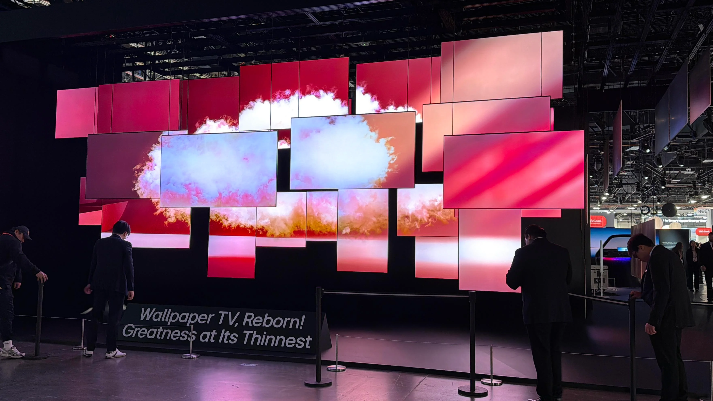
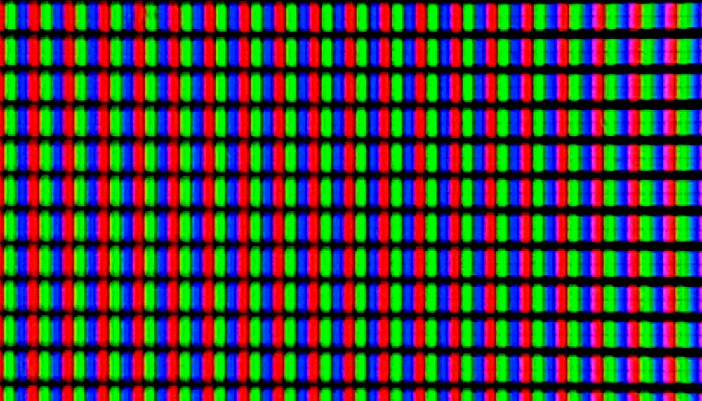
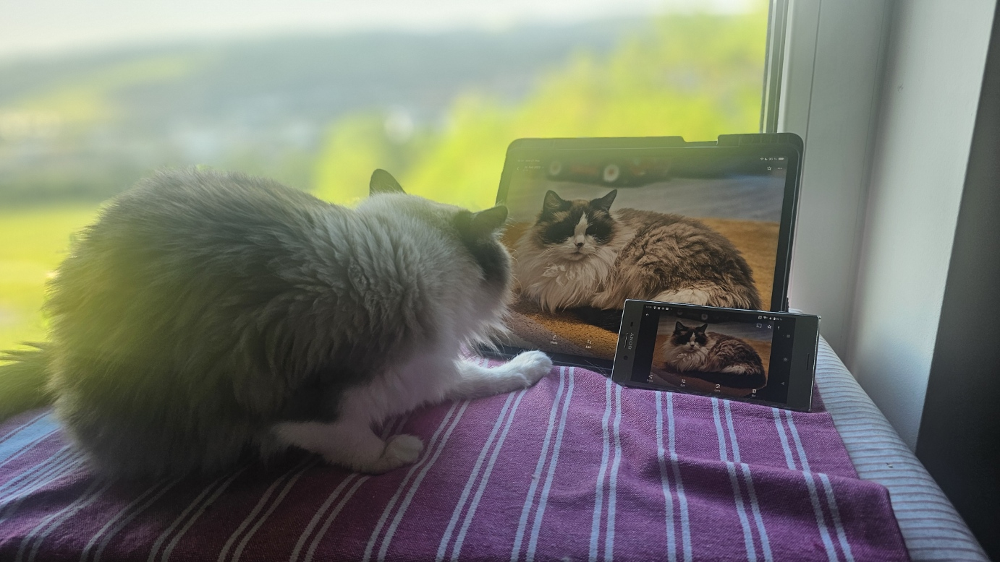
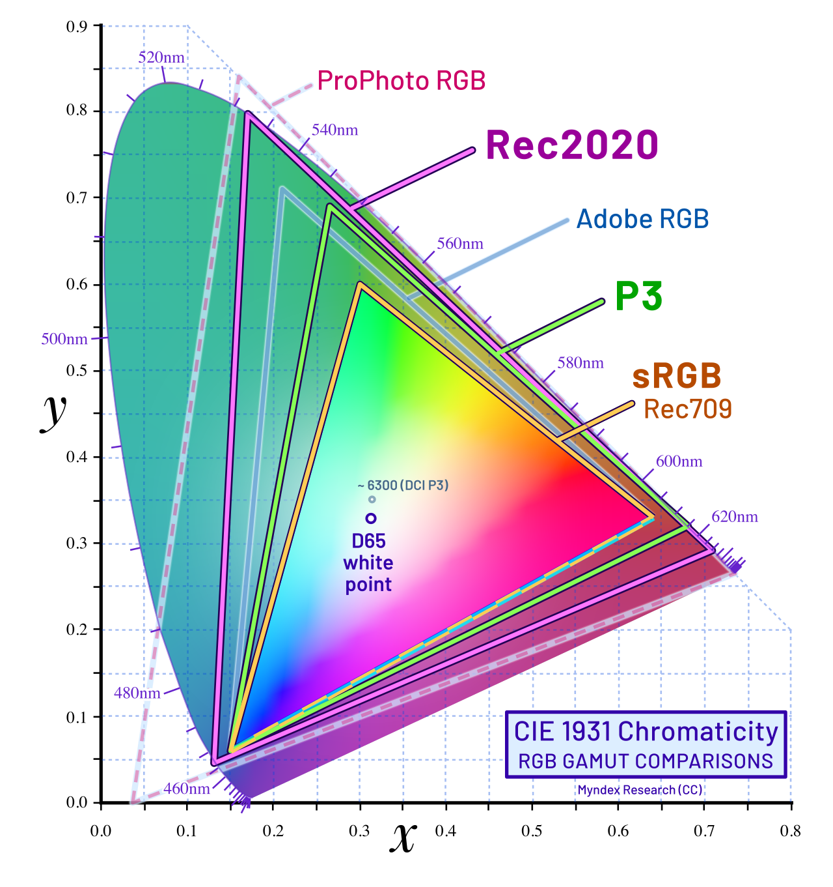

 "LG mamerin TV lineup nya di CES 2026" 

Kamu baru beli TV 85 inci (215 cm) 8K. Harganya 50 juta. Sales-nya senyum lebar, "Ini resolusinya paling tinggi di dunia Pak, jauh lebih tajam dari 4K."

Kamu bayar, senang, bawa pulang. Tiga bulan kemudian kamu sadar satu hal yang agak mengecewakan: konten streaming yang kamu nonton resolusinya 1080p atau 4K. TV 8K-mu cuma ngescale ke atas. Dan jujur, hasil upscale-nya nggak jauh beda sama TV 4K tetanggamu yang punya HDR bagus dan warna kebih terang.

"Moko ngelihat ini dari cat tree. Dia cuma ngangguk pelan, kayak bilang 'udah tau'."

*Ini cerita yang sering banget terjadi. Dan setelah 15 tahun di industri display: dari Sony VAIO, lewat Intel, sampai sekarang ngurusi automotive HMI: yang saya lihat justru sebaliknya. Konsumen terus dikejar-kejar resolusi, padahal faktor lain bikin display terasa jauh lebih beda.*

## Resolusi Itu Apa?

Resolusi itu jumlah titik pixel di layar. Pixel adalah titik-titik kecil yang menyusun gambar. Makin banyak pixel, makin detail yang bisa ditampilkan. Tapi "makin gede makin baik" itu cuma setengah benar.

Ini angka-angkanya:

- **HD (720p):** 1280 x 720 = sekitar 922.000 pixel: standar lama buat TV broadcast, sekarang udah nggak relevan
- **Full HD (1080p):** 1920 x 1080 = sekitar 2.074.000 pixel: masih jadi standar buat monitor office dan smartphone entry level
- **QHD (1440p):** 2560 x 1440 = sekitar 3.686.000 pixel: sweet spot buat monitor gaming dan laptop
- **4K UHD (2160p):** 3840 x 2160 = sekitar 8.294.000 pixel: standar baru buat TV, monitor premium, dan smartphone flagship
- **8K UHD (4320p):** 7680 x 4320 = sekitar 33.178.000 pixel: masih niche, konten langka, harga premium

Catatan kecil: "2K" di industri film sebenarnya 2048 x 1080 (DCI 2K), bukan 2560 x 1440. Tapi di dunia consumer, 2K biasanya merujuk ke QHD dan bahkan kadang FHD. Istilah 2K ini memang nggak konsisten dari awal: normal kalau kamu bingung.

Bayangkan kamu mewarnai kotak pakai titik-titik spidol. Titik-titiknya jarang (HD), garis-garisnya keliatan bergerigi. Titik-titiknya rapat (4K), garisnya mulus. Tapi kalau udah terlalu rapat (8K), mata manusia mulai nggak bisa bedain perbedaannya.

Foto Display dibawah microscope... keliatan kan RGB nya ?

## Pixel Density (PPI): Angka yang Lebih Jujur dari Resolusi Mentah

Resolusi tanpa ukuran layar itu kayak bilang "rumah saya luas" tanpa bilang berapa meter persegi. Konteksnya penting.

PPI atau Pixels Per Inch adalah kerapatan pixel dalam satu inci layar. Dan ini yang menentukan apakah kamu bisa lihat pixel-pixelnya atau nggak. 

Rumusnya simpel:

PPI = akar kuadrasi(pixel_tinggi² + pixel_lebar²) / diagonal_layar_inci

Coba lihat perbandingan ini:

| Perangkat                 | Ukuran        | Resolusi    | PPI  |
| ------------------------- | ------------- | ----------- | ---- |
| iPhone 15 Pro Max         | 6,7" (17 cm)  | 2796 x 1290 | ~460 |
| MacBook Pro 14" (35,6 cm) | 14,2" (36 cm) | 3024 x 1964 | ~254 |
| Monitor 27" (68,6 cm) 4K  | 27" (69 cm)   | 3840 x 2160 | ~163 |
| TV 55" (139,7 cm) 4K      | 55" (140 cm)  | 3840 x 2160 | ~80  |
| TV 55" (139,7 cm) 8K      | 55" (140 cm)  | 7680 x 4320 | ~163 |

Perhatikan sesuatu yang menarik di sini: TV 55 inci (140 cm) 8K punya PPI yang sama dengan monitor 27 inci (69 cm) 4K. Tapi monitor kamu lihat dari jarak 50-60 cm, sedangkan TV dari jarak 2-3 meter. Dari 3 meter, 80 PPI dari TV 4K udah cukup tajam. Mata kamu nggak bakal bisa bedain pixel 8K kecuali kamu merayap ke depan layar.

4K di layar 5 inci (12,7 cm - smartphone) itu beda banget sama 4K di layar 65 inci (165 cm - TV). Di smartphone, pixel-pixelnya rapat banget sampai mata nggak bisa bedain satu pixel sama pixel lainnya. Di TV 65 inci (165 cm), pixel-pixelnya lebih renggang.

## Jarak Pandang: Kenapa Resolusi yang Sama Terasa Beda

PPI kasih kita angka, tapi angka itu belum lengkap tanpa satu variabel lagi: jarak.

Pixel yang sama, dilihat dari dua jarak berbeda, bisa terasa tajam di satu sisi dan pecah di sisi lain. Kenapa? Karena yang mata kita "lihat" itu bukan ukuran pixel dalam milimeter, tapi seberapa besar pixel itu *menempati sudut pandang kita*.

Ini disebut angular density.

Ini dua-duanya keliatan tetep bagus ya... mungkin karena modelnya cakep ? (iPad 12.9, 264ppi vs Xepria XZ Premium, 4k smartphone with 807ppi !!(

Bayangkan kamu ngacungin jari telunjuk ke depan. Dari dekat, jarimu nutupin hampir seluruh pandangan. Mundur dua langkah, jarimu jadi kecil. Pixel di layar juga begitu — dari dekat, pixel individual terlihat besar dan terpisah. Dari jauh, pixel-pixel itu menyatu dan terlihat mulus.

Rumus cepatnya: **sudut_pixel_arcmin = 3438 x ukuran_pixel_mm / jarak_pandang_mm**

Arc minute? Satuan sudut: 1 derajat dibagi 60 = 1 arc minute. Mata manusia sehat bisa membedakan dua titik terpisah kalau jarak sudutnya minimal 1 arc minute. Di bawah itu, mata kamu udah nggak bisa bedain dua titik: mereka terlihat menyatu.

Apple nemuin ini dan menyebutnya "Retina Display" — titik di mana pixel individual udah nggak terlihat. Bukan marketing gimmick, tapi ilmu optik yang valid. PPI yang dibutuhkan supaya nyampe batas 1 arc-min ini tergantung jarak pandang:

| Perangkat         | Jarak Pandang | PPI Minimum (1 arc min) | 4K vs Retina                |
| ----------------- | ------------- | ----------------------- | --------------------------- |
| Smartphone (6,7") | 30 cm         | ~338 PPI                | 460 PPI sudah di atas batas |
| Laptop (15")      | 60 cm         | ~169 PPI                | 254 PPI sudah di atas batas |
| Monitor 27" 4K    | 70 cm         | ~145 PPI                | 163 PPI sudah di atas batas |
| TV 55" 4K         | 2,5 meter     | ~43 PPI                 | 80 PPI jauh di atas batas   |
| TV 65" 4K         | 3 meter       | ~37 PPI                 | 68 PPI jauh di atas batas   |
| TV 85" 4K         | 2 meter       | ~50 PPI                 | 52 PPI tepat di batas       |

Terlihat jelas: dari jarak normal, 4K di hampir semua perangkat sudah melewati batas yang mata kita bisa bedain. Pixel udah terlalu kecil.

Contoh konkretnya: pixel di TV 55 inci 4K ukurannya 0,32 mm. Dari jarak 2,5 meter, sudutnya 0,45 arc minute: jauh di bawah batas 1 arc minute. Pixel individual nggak terlihat.

Pixel 8K di TV yang sama? 0,16 mm. Dari 2,5 meter, sudutnya 0,22 arc minute. Masih jauh di bawah batas: artinya nggak ada perbedaan persepsi dengan 4K dari jarak normal.

Ini kayak kamu punya kamera 100 megapixel, terus print fotonya ukuran 3x4 cm. 2 megapixel aja udah cukup. Pixel berlebih cuma bikin file gede tanpa nambah kualitas print.

Jadi kapan 8K mulai masuk akal?

- TV 85 inci (215 cm) dari jarak 2 meter: pixel 4K ukurnya sekitar 0,5 milimeter, sudutnya mulai nyempit sama batas. Di situlah 8K mulai punya makna
- Jarak pandang sangat dekat: kurang dari 1,5 meter dari layar besar
- Konten profesional yang memang difilmkan di 8K, medical imaging, atau content creation yang butuh detail maksimal
- Atau kamu memang mau investasi buat masa depan 5-10 tahun ke depan

Kamu baca koran dari dekat, teksnya jelas. Kamu baca koran dari jauh, teksnya jadi nggak keliatan lagi. Tapi kalau kamu duduk seratus meter dari billboard, teks gede aja cukup. Layar juga begitu: jarak pandang menentukan seberapa detail yang bisa kamu tangkep.

*Di sini mampir dulu: kamu mungkin mikir "tapi saya emang liat 4K lebih tajam dari 1080p, kok?" Iya, benar. Tapi ketajaman itu bukan cuma dari resolusi — kita bahas kenapa dalam beberapa menit, karena ada faktor lain yang bikin 4K terasa lebih "hidup".*

## Kapan 4K vs 8K Memang Berarti?

Jujur, untuk kebanyakan orang, 4K udah lebih dari cukup. Ini kenapa:

**Konten 8K masih langka.** YouTube 8K? Ada tapi minim. Streaming service? Netflix belum punya konten asli 8K. Kamu bayar untuk kemampuan yang belum dipakai.

**Upscaling bisa menutupi gap-nya.** TV 4K modern punya chip upscaler yang bikin konten Full HD terlihat hampir sama dengan 4K asli. TV 8K juga punya upscaler tapi hasilnya tetap terbatas oleh sumber kontennya.

**Jarak pandang rumah rata-rata.** Kalau kamu duduk 2-3 meter dari TV 55 inci, PPI dari 4K (sekitar 80 PPI) udah jauh di atas batas yang mata manusia bisa bedain.

Buat konsumsi konten sehari-hari? 4K udah lebih dari cukup.

## Kenapa 4K Terasa Lebih Tajam dari 1080p

Kamu ngerasa 4K lebih tajam dari 1080p, padahal dari jarak normal mata kamu nggak bisa bedain pixel. Benar, dan itu karena faktor lain selain jumlah pixel.

Panel 4K yang lebih mahal biasanya juga punya color coverage lebih luas. Display yang nampilin warna akurat (Delta E kurang dari 2) dan coverage DCI-P3 bakal terasa "lebih tajam" secara subjektif. Mata kita lebih sensitif terhadap warna yang natural daripada pixel yang rapat.

Lalu ada luminance (keterangan display). TV HDR yang bisa nyampe 1.000-2.000 nits terasa jauh lebih hidup daripada TV 8K yang cuma 300 nits. Area gelap yang benar-benar hitam dan area terang yang benar-benar terang bikin gambar punya kedalaman.

Dan refresh rate. Buat gaming dan konten motion, 120Hz atau 240Hz ngerasa lebih smooth. Tapi baru terasa kalau kamu emang main game.

Resolusi itu kayak jumlah bumbu di resep masakan. Bisa aja kamu pakai 20 bumbu, tapi kalau teknik masak dan proporsinya salah, hasilnya tetap nggak enak. Warna akurat dan kontras tinggi itu kayak teknik memasak yang tepat: yang benar-benar bikin masakan terasa beda.

## Kualitas Display : Faktor yang Lebih Berdampak dari Resolusi

Resolusi dan PPI udah kamu paham. Tapi ada hal lain yang jauh lebih berdampak pada persepsi kualitas visual.

Setelah 15 tahun di industri display, saya bisa bilang dengan tegas: resolusi bukan faktor paling penting. Ini daftar faktor yang lebih impactful buat saya:

### Color Coverage: Rentang Warna

Color coverage tentuin seberapa luas rentang warna yang bisa ditampilkan. sRGB itu standar dasar. DCI-P3 lebih luas, dipakai di cinema dan smartphone modern. Rec.2020 adalah standar HDR yang paling luas...masih belum kebeli tapi untuk yang *true* Rec.2020.

Display dengan coverage DCI-P3 95% atau lebih bakal nampilin warna yang jauh lebih kaya dan natural dibanding display dengan sRGB 100% yang nggak bisa nyampe DCI-P3. Dan ini jauh lebih terasa secara visual daripada naikin resolusi dari 4K ke 8K, karena gambar akan terlihat lebih indah (kalau akurasinya tepat).

Ini diagram yang berarti sekali untuk display engineer soalnya secara tidak langsung mengatakan "berapa mahal display ini" 

### Color Accuracy: Ketepatan Warna

Color accuracy diukur dengan Delta E (DE). DE kurang dari 1 artinya bedanya nggak terlihat mata telanjang. DE kurang dari 2 adalah target profesional. DE lebih dari 3 sudah keliatan beda.

Display dengan DE kurang dari 2 nampilin warna kulit yang natural, langit yang nggak terlalu biru, hijau daun yang nggak neon. Semua ini bikin pengalaman visual terasa lebih premium. Dan ini jauh lebih impactful daripada pixel yang lebih rapat.

### Luminance: Keterangan display

Peak brightness diukur dalam candela/m² sering dibilang "nits" juga. Buat HDR content, kamu butuh minimal 600 nits, idealnya 1.000-2.000 nits. Buat outdoor display kayak di dashboard mobil, kamu butuh >1.000 nits idealnya karena cahaya matahari bisa nyampe 100.000 lux di dashboard.

Di industri automotive HMI, luminance dan contrast juga krusial. Display mobil harus terbaca di bawah sinar matahari langsung: jadi kami prioritaskan brightness dan anti-glare coating, bukan resolusi ultra tinggi.

### Refresh Rate

Refresh rate tentuin seberapa sering gambar diperbarui per detik. 60Hz itu standar, 120Hz terasa smooth untuk gaming, 240Hz buat competitive gaming. Buat konten statis, refresh rate nggak penting. Tapi buat gaming dan konten motion, 120Hz atau 240Hz memberikan smoothness yang benar-benar terasa. Layar 1080p 120Hz bisa terasa lebih responsif daripada 4K 60Hz.

### Kontras: Hitam yang Benar-Benar Hitam

Kontras itu rasio antara pixel terang nhất dengan pixel gelap nhất. Resolusi bisa tinggi, color coverage luas, brightness gede : tapi kalau kontras jelek, gambar terlihat flat dan nggak punya kedalaman.

Di sini teknologi panel membuat perbedaan besar:

**OLED:** Setiap pixel menyala mandiri. Pixel hitam benar-benar mati: kontras tak terhingga (atau disebut "infinite contrast"). Ini keunggulan utama OLED. Gambar punya kedalaman yang luar biasa karena area gelap benar-benar hitam, bukan abu-abu gelap. OLED juga punya warna yang jenuh karena pixel-nya bisa sangat terang.

**Mini LED:** Masih LCD tapi dengan ribuan zone backlight yang bisa di-off-on secara independen. Kontras tinggi (1.000:1 sampai 100.000:1 tergantung jumlah zones) tapi masih punya blooming: area terang di sekitar pixel gelap karena cahaya dari zones yang belum cukup terisolasi. Mini LED unggul di brightness (bisa nyampe 3.000-4.000 nits peak) yang jauh di atas OLED.

**Micro LED:** Teknologi masa depan. Setiap sub-pixel (merah, hijau, biru) adalah chip LED mikro yang menyala mandiri, seperti OLED tapi dengan brightness lebih tinggi dan tanpa risiko burn-in. Samsung The Wall dan Sony Crystal LED sudah pakai ini. Masih mahal banget: TV 110 inci (279 cm) bisa 100 juta rupiah atau lebih: tapi ini arah industri.

**LCD biasa:** Kontras rendah (1.000:1 sampai 2.000:1). Hitam terlihat abu-abu karena backlight selalu menyala. Ini kenapa TV LCD murah terlihat flat meskipun resolusinya 4K.

Kontras kayak volume bass di musik. Bisa aja lagu punya semua instrument (resolusi tinggi, warna akurat), tapi kalau bass-nya datar, musik terdengar flat. OLED punya bass yang dalam: hitam yang benar-benar hitam bikin gambar terasa hidup.

TV 4K OLED 43 inci (109 cm) terasa jauh lebih "bagus" daripada TV 8K LCD biasa. Bukan cuma karena resolusi, tapi karena kontras yang bikin gambar punya kedalaman. Industri juga sudah pergeseran fokus: dari naikin resolusi ke teknologi panel yang lebih baik.

Resolusi kayak jumlah bumbu di resep. Color accuracy kayak kualitas bahan. Luminance kayak teknik masak. Refresh rate kayak cara penyajian. Kontras itu panggung tempat semuanya ditampilkan : panggung yang gelap dengan spot cahaya yang tepat bikin presentasi terasa dramatis.

## Prioritas Saya sebagai Engineer Display

Kalau kamu tanya saya apa yang penting dari display, urutannya begini:

1. **Color accuracy (Delta E kurang dari 2)**: Warna yang natural lebih penting dari pixel yang rapat
2. **Color coverage (DCI-P3 95% atau lebih, Rec.2020 untuk HDR)**: Rentang warna yang luas buat konten modern
3. **Luminance (cukup untuk penggunaan)**: Brightness yang sesuai kebutuhan
4. **Consistency**: Warna dan brightness yang konsisten di seluruh panel dan antar panel
5. **Resolusi**: Cukup tajam, bukan yang tertinggi (4k monitor cukup lah, kalau laptop sekitar QHD)
6. **Refresh rate (sesuai kebutuhan)**: 60Hz buat konten statis, 120Hz atau lebih buat gaming

Resolusi ada di urutan agak bawah. Bukan karena nggak penting, tapi setelah nyampe threshold tertentu, naikin resolusi nggak terasa signifikan. Naikin color accuracy atau brightness selalu kerasa bedanya.

Ini kayak beli mobil. Resolusi itu kayak ukuran velg: gede terlihat keren tapi nggak nambah performa. Color accuracy, brightness, dan refresh rate itu kayak mesin, suspensi, dan pengereman: yang bener-bener ngaruh ke pengalaman berkendara.

## Tren Industri Display 2026

Dunia display sekarang fokus di hal-hal selain resolusi, dan ini menarik buat dilihat.

**Smartphones:** Panel OLED udah stagnan di 1440p. PPI di atas 500 udah nggak ada gunanya, dan baterai lebih diutamakan. Fokus sekarang ke brightness (2.000-3.000 nits peak outdoor brightness), color accuracy yang lebih baik, dan efisiensi daya.

**TV:** 4K masih raja. 8K TV ada tapi penjualannya kecil: kurang dari 5 persen dari total penjualan TV. Samsung, LG, Sony punya model 8K tapi masih sangat niche, dan beberapa TV maker sudah memutuskan untuk *discontinue* TV 8K. Fokus industri di Mini LED backlight (1.500-4.000 nits peak), OLED yang lebih efisien, dan upscaler yang lebih pintar.

**Monitor:** 4K 144Hz mulai jadi standar baru buat monitor gaming premium dan creative professional. Apple push 5K dan 6K di Pro Display XDR. Buat gaming, 2560 x 1440 165Hz masih sweet spot (ini juga memikirkan performance dari graphic card).

**Automotive HMI:** Di industri mobil, resolusi tetap di 1920 x 720 atau 2560 x 1440 karena jarak pandang dekat (30-60 cm). Fokus di brightness (1.000+ nits), anti-glare coating, color consistency antar panel, dan reliability di suhu ekstrem minus 40 derajat Celsius sampai 85 derajat Celsius.

**MicroLED:** Masih berkembang. Samsung The Wall dan Sony Crystal LED sudah ada tapi harganya masih premium. Teknologi ini menjanjikan brightness tinggi tanpa risiko burn-in.

## Jadi Harus Pilih Apa?

Nggak ada jawaban universal, tapi ini panduan berdasarkan penggunaan:

**Smartphone:** 1440p (QHD+) udah lebih dari cukup. Fokus ke panel OLED yang bagus, brightness tinggi, dan baterai.

**Monitor produktivitas:** 2560 x 1440 atau 4K. Prioritaskan color accuracy (IPS atau OLED) daripada refresh rate.

**Monitor gaming:** 2560 x 1440 144Hz atau 4K 120Hz. Sweet spot antara ketajaman dan performa.

**TV:** 4K HDR dari merek yang punya panel bagus dan processing baik. 8K? Nggak perlu sekarang.

Dan sebagai profesional, saya selalu prioritaskan: color coverage luas, color accuracy tinggi (Delta E kurang dari 2), brightness yang cukup, dan consistency antar panel. Resolusi tinggi bagus, tapi bukan prioritas utama kalau harus milih.

## Penutup

Resolusi penting, tapi bukan segalanya. PPI lebih penting dari resolusi mentah karena kasih konteks ukuran layar. Jarak pandang menentukan apakah kamu bisa lihat perbedaannya. Dan kualitas display yang sebenarnya itu kombinasi dari warna akurat, kontras tinggi, brightness cukup, dan refresh rate yang sesuai kebutuhan.

Jangan tergiur angka 8K kalau kamu belum paham konteksnya. Display yang "bagus" bukan yang punya pixel paling banyak. Tapi yang bisa nampilin gambar dengan warna natural, kontras tepat, dan detail yang cukup dari jarak pandangmu.

Saya pribadi lebih milih color coverage yang luas, color accuracy tinggi, dan luminance yang cukup daripada sekadar resolusi tinggi. Karena pada akhirnya, apa yang mata kita lihat sebagai "kualitas bagus" itu kombinasi dari warna akurat, kontras tepat, dan detail cukup: bukan sekadar pixel yang banyak.

---
*Referensi:*

- *Retinal cone density: https://www.nature.com/articles/eye2016169*
- *Rec.2020 color space: https://en.wikipedia.org/wiki/Rec._2020*
- *DCI-P3 vs sRGB: https://en.wikipedia.org/wiki/DCI-P3_color_space*
- *Angular resolution: https://en.wikipedia.org/wiki/Angular_resolution*
