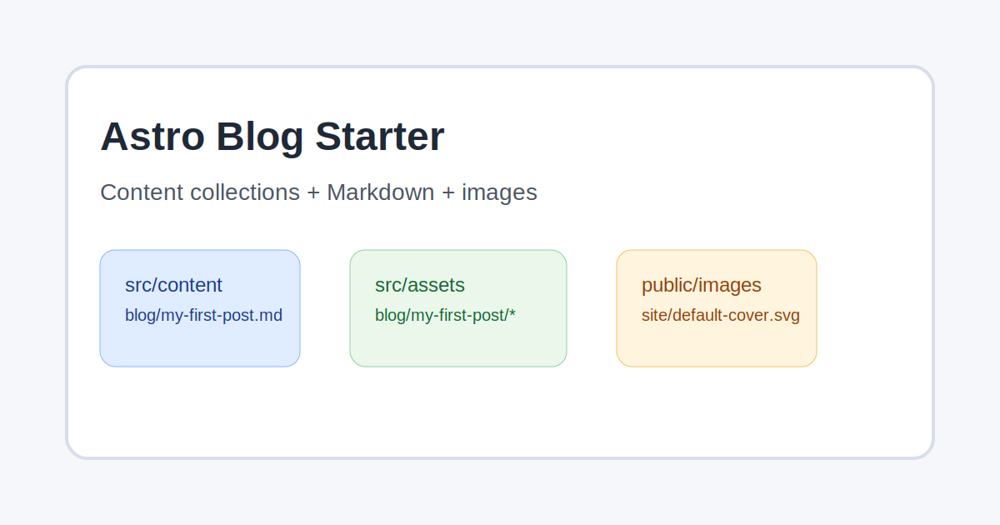

## Hello Astro

This is my first post written in Markdown.

You can write normal Markdown here, including lists:

- Fast static pages
- Content collections
- Simple blog workflow

## Image inside Markdown

Here is an image called from the Markdown file itself:

## Public image example

If you put an image in `public/images/site/default-cover.svg`, call it like this:

